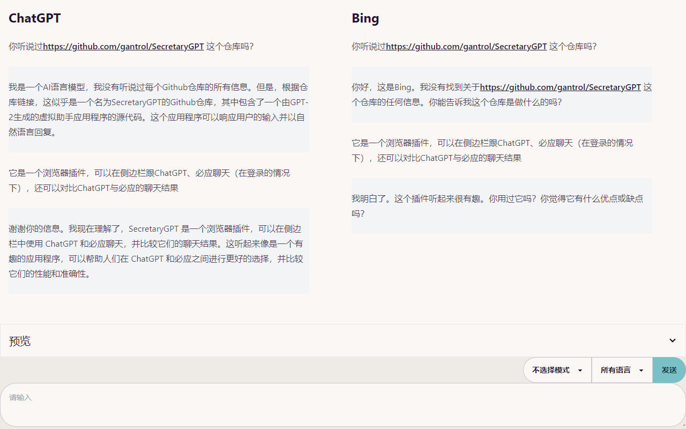

# 小秘书-浏览器插件

你想有一位秘书，帮你刷新闻、为你解释一切吗？

> 非常早期的产品

1. 在浏览器侧边栏跟 ChatGPT 或 Bing 对话, 在网页选择好文字，就准备好发到 ChatGPT 了
2. 比较模式, ChatGPT vs Bing
3. “扮演解释”模式，让ChatGPT自动判定上下文大体是怎样的角色，然后给出解释

## 介绍

### 日报订阅

#### 即刻关注日报

希望能给你带来快乐。（关注多的谨慎使用）

#### 微博关注日报

TODO: 

### 侧边栏

### ChatGPT vs Bing

## 参考

[1] SSE 代码 [chatgpt-api](https://github.com/transitive-bullshit/chatgpt-api#reverse-proxy)
