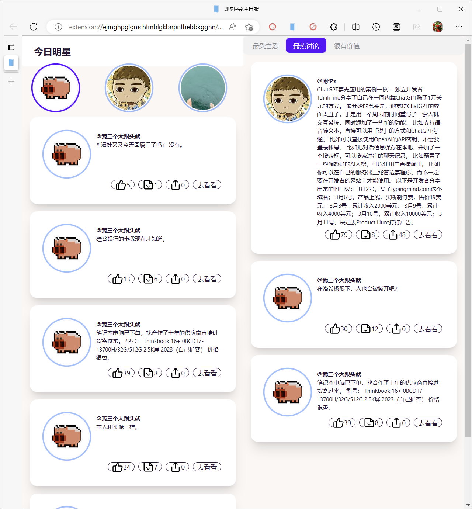

# 小秘书-浏览器插件

你想有一位、甚至多位秘书，帮你刷新闻、为你解释一切吗？

> 非常早期的产品
> 
> 计划砍掉 New Bing 

1. 在浏览器侧边栏跟 ChatGPT 或 Bing 对话, 在网页选择好文字，就准备好发到 ChatGPT 了
2. 在新的标签页, 同时与 ChatGPT 跟 Bing 聊天
3. “扮演解释”模式，让ChatGPT自动判定上下文大体是怎样的角色，然后给出解释

## 使用说明

### 使用准备

- 要用什么功能，就需要先在同一浏览器下登录对应账号。比如，ChatGPT要在https://ai.com上登录，即刻的要登录即刻
- 特别地，Bing目前需要打开一个聊天会话

### 下载安装

下载：

1. 去到[发布](https://github.com/gantrol/SecretaryGPT/releases)，
2. 点击最新版本的 `chrome-mv3-prod.zip` ，开始下载
3. 解压缩

安装：
1. 打开 Google Chrome / Edge 浏览器。
2. 点击浏览器右上角的“菜单”按钮（通常是三个竖排的点或线）。
3. 选择“更多工具” > “扩展程序”选项。这将打开 Chrome 的扩展程序页面。
4. 在扩展程序页面，找到并点击页面右上角的“开发者模式”开关按钮。这将启用开发者模式，以便您可以手动加载已解压的扩展程序。
5. 点击页面左上角的“加载已解压的扩展程序”按钮。这将打开一个文件浏览器窗口。
6. 在文件浏览器窗口中，找到您刚刚解压缩的浏览器插件文件夹。选择该文件夹并点击“选择文件夹”按钮。
7. 如果一切正常，该插件应该已经被成功加载到 Chrome 浏览器中。在扩展程序页面中，您应该可以看到该插件的图标，并且可以在浏览器中使用该插件了。

## 介绍

### 侧边栏

### ChatGPT vs Bing

### 日报订阅

#### 即刻关注日报

希望能给你带来快乐。（关注多的谨慎使用）

#### 微博关注日报

TODO:

## 参考

[1] SSE 代码 [chatgpt-api](https://github.com/transitive-bullshit/chatgpt-api#reverse-proxy)
