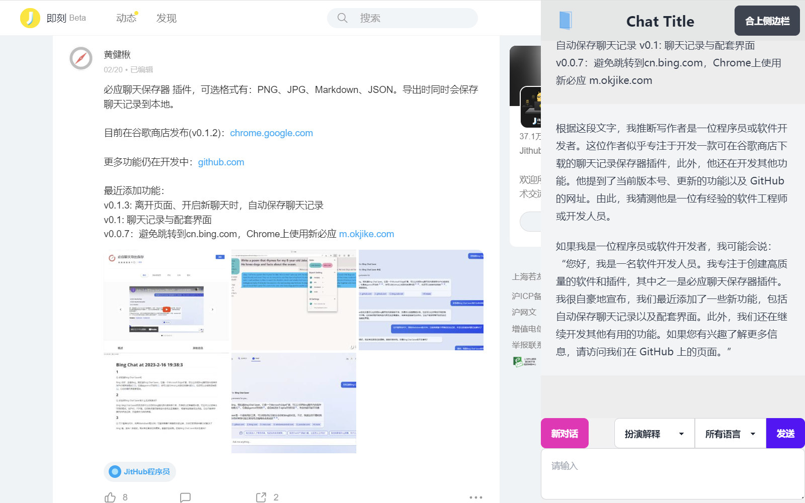

# ChatGPT Sidebar  Web Extension

> In very early stage, not ready for use.

1. Chat with ChatGPT or Bing in the browser sidebar;
2. Select text on the webpage, and it's ready to be sent to ChatGPT;
3. Compare Bing and ChatGPT in a tab page.

## Introduction

### Sidebar

### Tab Page

enter by clicking the extension icon and click the "VS" button in the popup.

## Reference

[1] SSE code from [chatgpt-api](https://github.com/transitive-bullshit/chatgpt-api#reverse-proxy)
